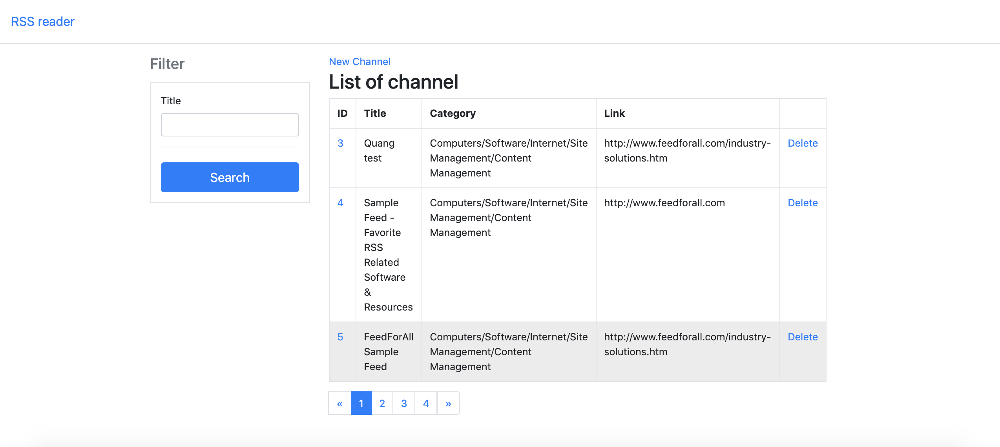
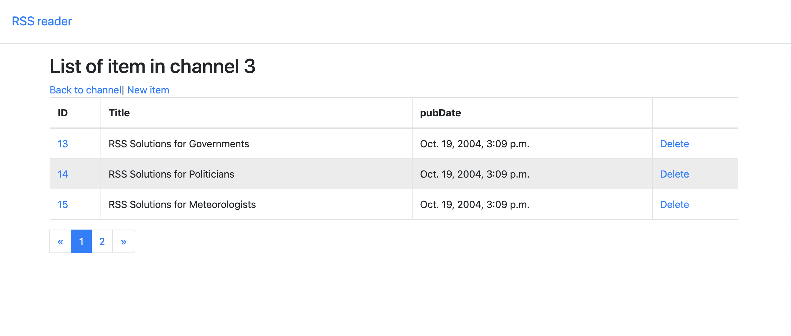
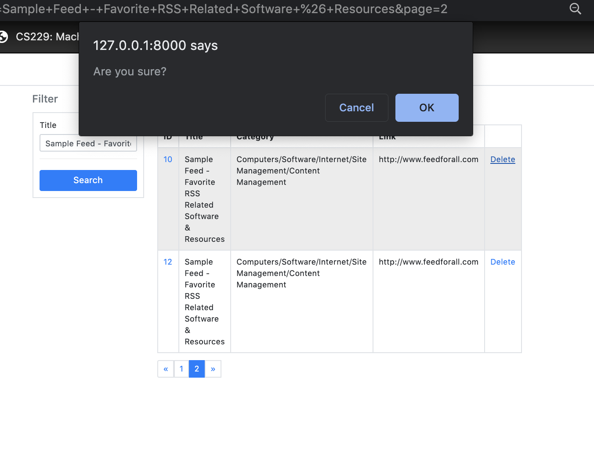
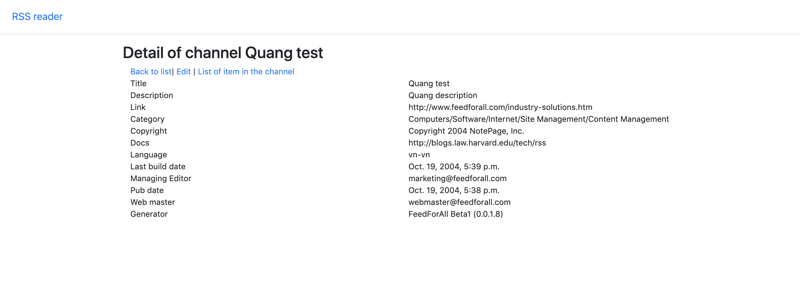
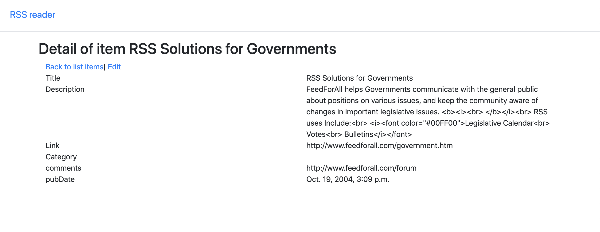
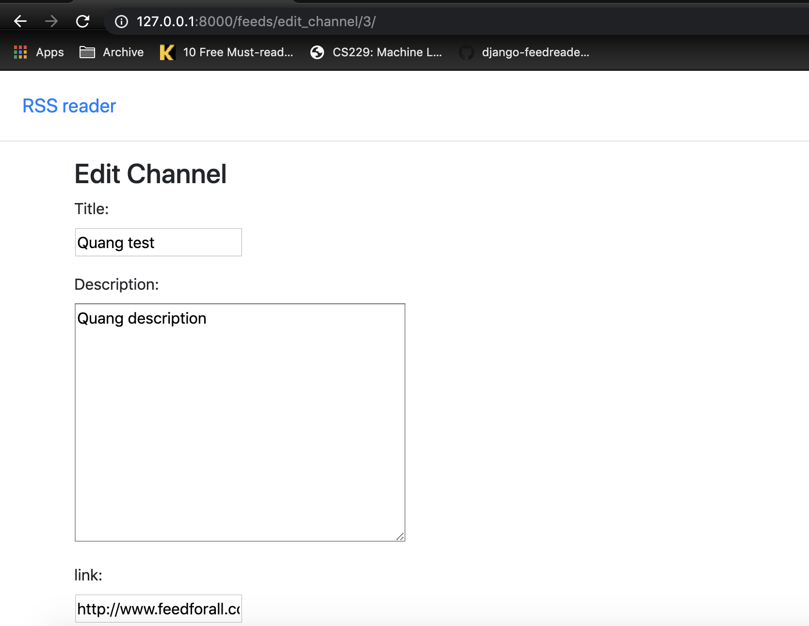
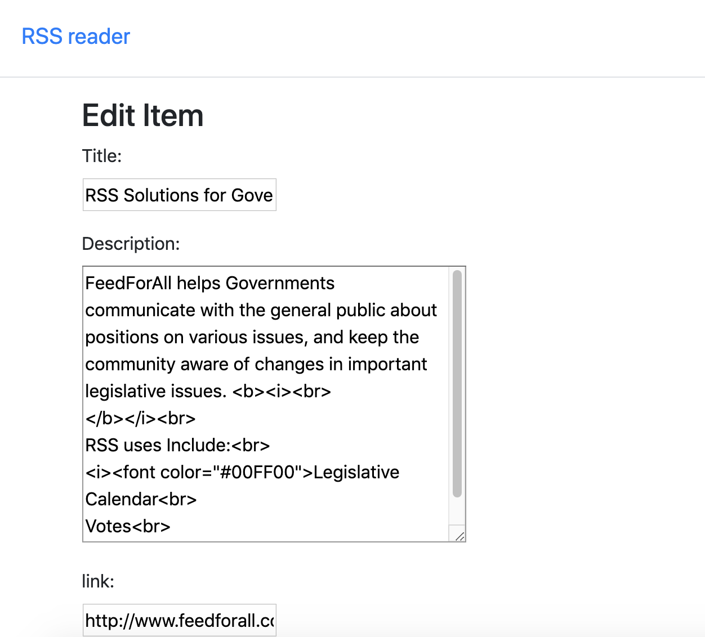
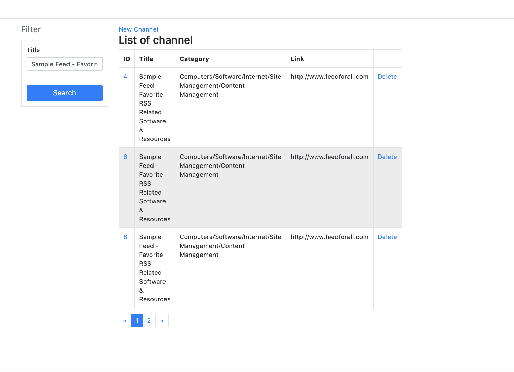
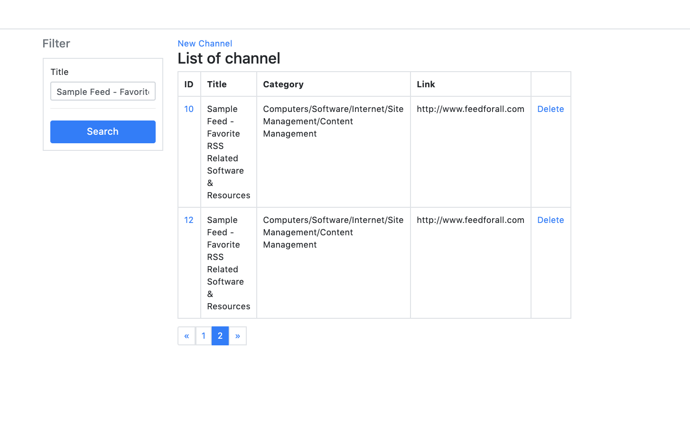
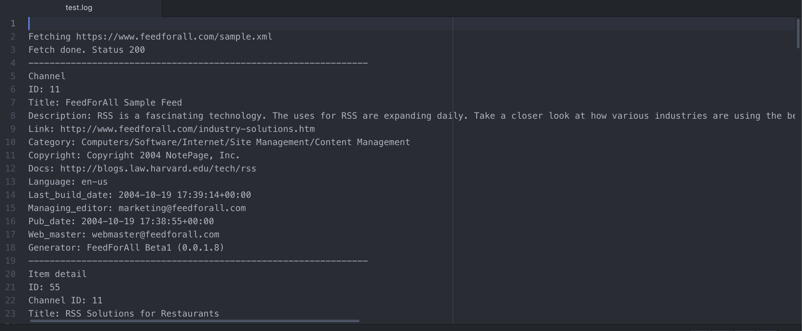

# feeds-reader
A feeds reader building in Django to allow you subscribe to RSS (and other) feeds.

## Features

* Consumes RSS feeds.  
* Parses feeds liberally to try and accomodate simple errors.
* Grab feed by given list of URLs.
* See feed items in log files.
* See in of item via web-based, pagination
* Filter items.
* Insert, update, delete item manually via a web form.

## Basic Models

A feed is represented by a `Channel` object which has (among other things) a `link`.

`Channel` have many `Items` which contain the content.

A full description of the models and their fields in `models.py`.

## How to setup database
In this project, I use SQLite to store database. To setup datatabse run
`python manage.py migrate` 

## How to run command to grab item
`python manage.py grab_item <list_of_urls_seperate_by_comma> <log_file>`
  * <list_of_urls_seperate_by_comma>: List of feeds URLs need to grab item (seperate by comma)
  * <log_file>: path of log file to store while grab item

## How to setup web server
 * Create a python 3.7 version
 * Run `pip install -r requirements.txt`
 * Move to project folder `cd feed`
 * Start server `python manage.py runserver`

## User web-based interface
* List of grab channel: `<server_host>:<server_port>/feeds/`
* Detail of channel: `<server_host>:<server_port>/feeds/<channel_id>`
* Edit channel `<server_host>:<server_port>/feeds/edit_channel/<channel_id>`
* Display all item belong channel: `<server_host>:<server_port>/feeds/items/<channel_id>`
* Detail of item: `<server_host>:<server_port>/feeds/detail_item/<item_id>`
* Edit item: `<server_host>:<server_port>/feeds/edit_item/<item_id>`

## Some screenshots
* List of chanel

* List of item in channel

* Delete channel

* Detail chanel

* Detail item

* Edit channel

* Edit item

* Filter but keep value when pagination

* Log file whine grab feed

## Authors

### Quang Nguyen
* email: nguyenvanquang247@gmail.com
* skype: quang_nguyen_247
* https://github.com/quang-sudo/